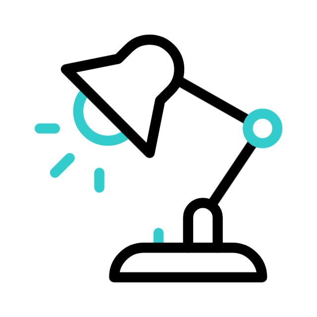

# Lamp – Furniture Design Studio

Lamp is a frontend-focused web application built with **Next.js (TypeScript + React)**, showcasing **UI** and **HCI (Human–Computer Interaction)** skills.  
It allows designers to create, customize, and visualize room layouts in **2D and 3D**, with an intuitive and modern interface.  

---

## ✨ Features

- **Homepage** introducing the Lamp app and its purpose.  
- **Designer Login** to access the workspace.  
- **Dashboard** for managing design projects.  
- **2D Layout Editor** using **HTML + CSS Grid** for interactions (drag, rotate, scale furniture).  
- **3D Visualization** powered by **React-Three-Fiber (R3F)** and **Three.js** for immersive previews.  
- **Reusable Components**:
  - Dashboard sidebar panel  
  - Furniture library  
  - Room configuration panel  
  - Pop-up modals for settings and customization  
- **Project Management**: create, customize, and save room layouts.  

---

## 🛠️ Tech Stack

- **Next.js (TypeScript + React)** – UI framework  
- **Tailwind CSS** – Styling  
- **Next.js Dynamic Routing** – Page navigation  
- **Next.js SSR & CSR** – Efficient rendering for 2D/3D functions  
- **HTML + CSS Grid** – 2D layout editing  
- **React-Three-Fiber & Three.js** – 3D rendering and visualization  

---

# Installation

### Clone Repository
```bash
git clone https://github.com/your-username/lamp-app.git
```

### Navigate to root
```bash
cd hci_referral_project_lamp
```

### Install dependencies
```bash
npm install
```

### Start development server
```bash
npm run dev
```
