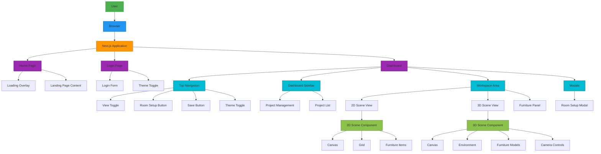

# Frontend User-Centric Architecture Diagram

## Overview

This document provides a user-centric architecture diagram for the Lamp Furniture Design Studio application. The application is a Next.js-based furniture visualization tool that allows users to create 2D and 3D room designs.

## Architecture Diagram

## Component Descriptions

### 1. User Interface Layer

#### Home Page
- **Loading Overlay**: Shows a loading animation when the page first loads
- **Landing Page Content**: Main content with:
  - Hero section with application title and description
  - Feature cards highlighting key functionality
  - Call-to-action button to start designing

#### Login Page
- **Login Form**: Form for user authentication with username and password fields
- **Theme Toggle**: Component to switch between light and dark themes

#### Dashboard
- **Top Navigation**: Header with:
  - View toggle (2D/3D)
  - Room setup button
  - Save button
  - Theme toggle
- **Dashboard Sidebar**: Navigation panel with:
  - Project management features
  - List of saved projects
- **Workspace Area**: Main content area with:
  - 2D Scene View
  - 3D Scene View
  - Furniture Panel
- **Modals**: Overlay dialogs including:
  - Room Setup Modal

### 2. Scene Components

#### 2D Scene Component
- **Canvas**: 2D rendering area
- **Grid**: Grid system for precise placement
- **Furniture Items**: Draggable furniture elements

#### 3D Scene Component
- **Canvas**: 3D rendering area using React Three Fiber
- **Environment**: Room environment with lighting and textures
- **Furniture Models**: 3D models of furniture items
- **Camera Controls**: Interactive camera for viewing the scene

### 3. State Management

The application uses Zustand for state management with the following key stores:

- **Authentication State**: Tracks user login status
- **Project State**: Manages current project and list of saved projects
- **UI State**: Controls active view (2D/3D), selected furniture, and panel visibility
- **Camera State**: Manages camera position and target
- **Furniture State**: Tracks furniture items in the current project

### 4. Data Flow

1. User interacts with UI components
2. UI actions update the application state via Zustand store
3. State changes trigger re-renders of relevant components
4. Components fetch data from the store as needed
5. For 3D visualization, React Three Fiber manages the WebGL rendering

## Key Features

- **Responsive Design**: Adapts to different screen sizes
- **Theme Support**: Light and dark mode options
- **2D/3D Visualization**: Switch between 2D floor plans and 3D room visualization
- **Drag-and-Drop**: Intuitive furniture placement
- **Project Management**: Save and load design projects
- **Real-time Preview**: See changes immediately in both 2D and 3D views

## Technologies Used

- **Next.js**: React framework for production
- **React**: UI library
- **Zustand**: State management
- **React Three Fiber**: 3D rendering
- **Tailwind CSS**: Styling
- **Shadcn/ui**: UI components
- **Lucide React**: Icons